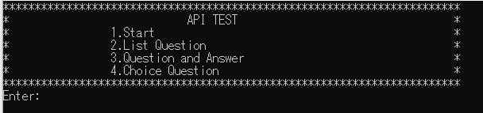
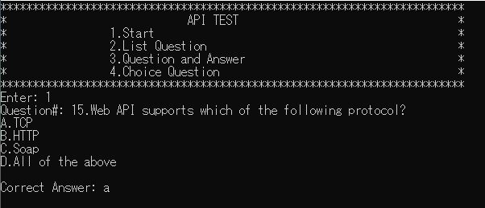
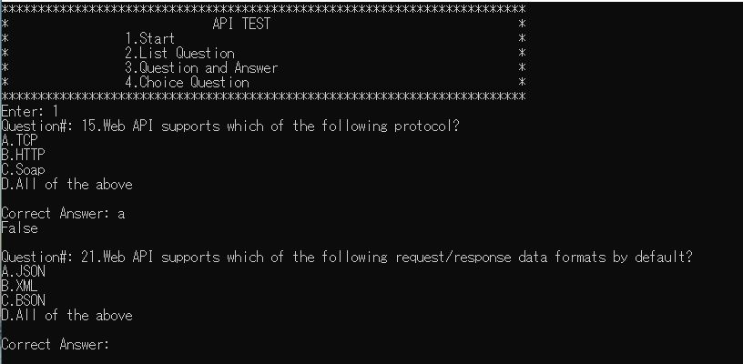
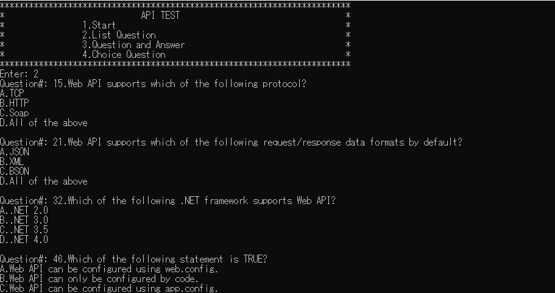
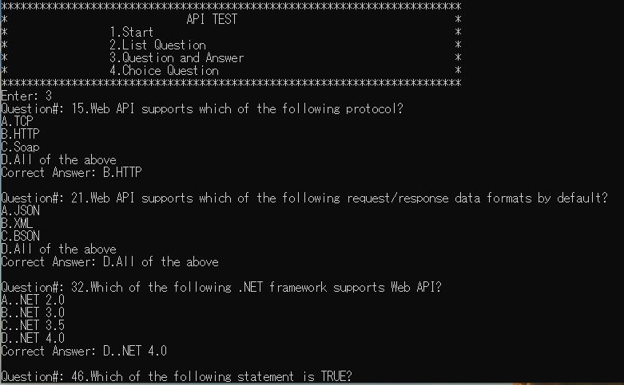
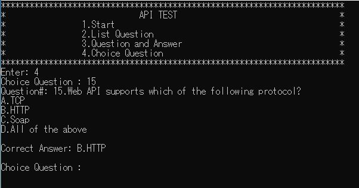

Git workflow atlassian: https://www.atlassian.com/git/tutorials/comparing-workflows/gitflow-workflow
```bash
$ git checkout develop
$ git checkout -b feature-{your_name}
$ git add .
$ git commit -m "your message"
$ git push origin feature-{your_name}

create merge request in gitlab
```
# Exercises
1. Read file API_TEST.txt
2. Write the program as follows:
- Display menu.

 
 
- Choice 1.

 
 
- Enter Answer. After entering the answers, check the answers. If correct, display True, false display below. Then the next question is displayed. 

 
 
- Choice 2.



- Choice 3.



- Choice 4.



## Notes
- Using Regular expression.
- Using for, foreach.
- Using Collections, LINQ (options).
